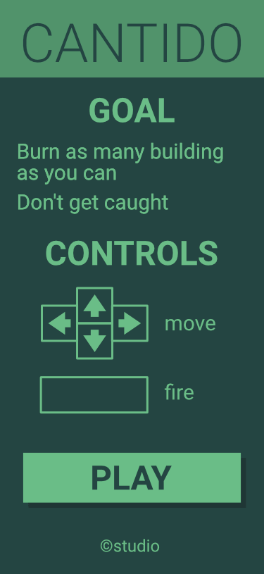
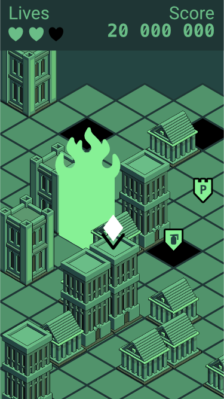

# contido gameplay

<!-- START doctoc generated TOC please keep comment here to allow auto update -->
<!-- DON'T EDIT THIS SECTION, INSTEAD RE-RUN doctoc TO UPDATE -->

- [screens](#screens)
- [map](#map)
- [avatar](#avatar)
- [NPCs](#npcs)
- [buildings](#buildings)
- [score](#score)

<!-- END doctoc generated TOC please keep comment here to allow auto update -->

 

## screens

- **home**
  - present the goal of the game
  - present the controls & gameplay
  - have a play button
  - have the studio name
- **game**
- _optional_ **help**
  if we want to deport goals/controls explanations away from the home screen
- _optional_ **about/story**
  if we want to deport studio informations and add some backstory
- _optional_ **high score**
  we could maintain a local high score board
- _optional_ **controls**
  could allow the suer to redefine the controls

## map

- isometric map
- size to be defined

## avatar

- the player “sim like” arrow
- the camera is always centered on it
- jump square to square

## NPCs

all the NPCs moves at a regular interval (can try with 1 second)

### police

- will try to catch you.
- the more point you are, the more police there is.
- can't be killed

### fireman

- will rebuild buildings (make a pause fore interval \* 3)
- can be killed if you set fire on the same square
- come in limited number (lets say 3)

## buildings

- have 3 types of building
  ⚠️ make sure that building aren't more than 1.5 taller than another
  This can lead to hidden buildings…
- building can be burned (dark square)
  _optional_ make assets for crumbled buildings
- _optional_ **weapons**
  can be burned by only by a specific type of weapon

## score

- each building burned add 100
